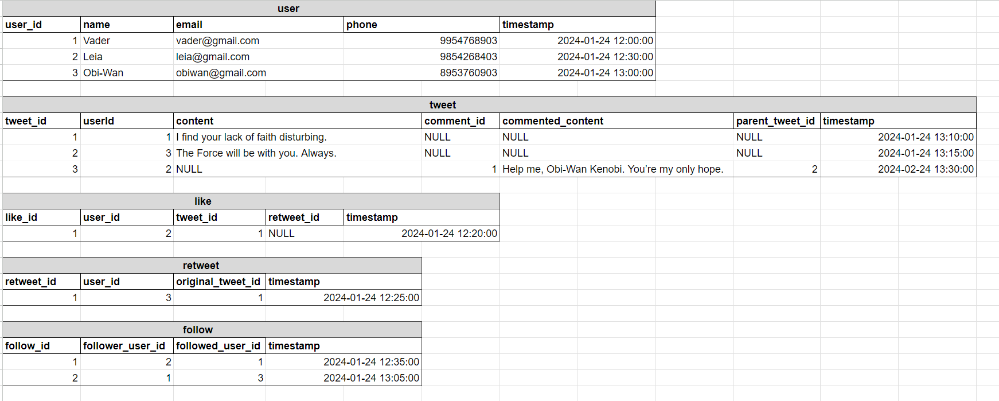

# Twitter Data

## Sample Data Population

1. **User Creation:**
   - Users Vader, Leia, and Obi-Wan are added to the Users table.

2. **Tweet Posting:**
   - Vader posts a tweet with the content "I find your lack of faith disturbing."
   - Obi-Wan tweets with the content "The Force will be with you. Always."

3. **Interactions:**
   - Leia likes Vader's tweet.
   - Obi-Wan retweets Vader's tweet.
   - Leia follows Vader.
   - Vader follows Obi-Wan.

4. **Commenting:**
   - Leia comments on Obi-Wan's tweet with the content "Help me, Obi-Wan Kenobi. You're my only hope."
